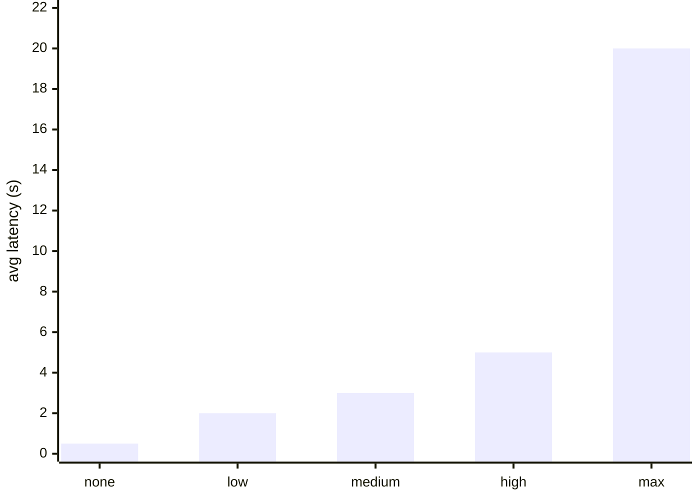
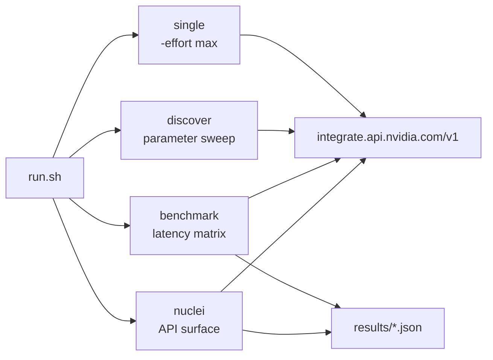

<div align="right">


</div>

# nim-inkling-api-research

### Compatibility, parameter discovery, and latency characterization for `thinkingmachines/inkling` on NVIDIA NIM.

> Research-grade tooling that answers the questions you hit *before* you build on a new NIM endpoint: which parameters does it actually accept, what does it silently ignore, how does latency scale with reasoning effort, and where do strict-typed clients crash.

NIM endpoints are OpenAI-*shaped*, not OpenAI-*compatible*. Parameters get accepted-but-ignored, rejected outright, or return shapes that break typed clients. This suite maps the real contract of the `thinkingmachines/inkling` endpoint — a 975B MoE — so downstream code is written against observed behavior, not docs.

---

## Key findings

| Parameter | NIM support | Notes |
|---|---|---|
| `max_tokens` | ✅ | primary output limit (ceiling: 16,384) |
| `max_completion_tokens` | ❌ | rejected — use `max_tokens` |
| `chat_template_kwargs.reasoning_effort` | ✅ | valid: `none`, `low`, `medium`, `high`, `max` |
| `reasoning_effort` (top-level) | ⚠️ | accepted but **ignored** |
| `stream` | ✅ | SSE supported |

### Latency by reasoning effort



| Effort | Avg latency |
|---|---|
| `none` | ~500 ms |
| `low` | ~2 s |
| `medium` | ~3 s |
| `high` | ~5 s |
| `max` | ~20 s+ |

### Edge case: `reasoning_tokens: null`

When `reasoning_effort=none`, the API returns `null` for `reasoning_tokens`. Strict-typed clients (Rust/serde) crash with `invalid type: null, expected u32`.

**Fix**: use `reasoning_effort: "max"` or handle nullable fields.

### Model specs

| Spec | Value |
|---|---|
| Model ID | `thinkingmachines/inkling` |
| Architecture | 975B MoE (41B active) |
| Context window | 1,048,576 tokens |
| Max output (NIM) | 16,384 tokens |
| Layers | 66 |
| Experts | 256 routed + 2 shared |

---

## Quick start

```bash
export NVIDIA_API_KEY          # from your secrets store — never hardcoded
./run.sh single                # one max-effort test
./run.sh discover              # parameter discovery sweep
```

All four modes: `./run.sh [single|discover|benchmark|nuclei]`. The `nuclei` mode runs the template in `templates/` and writes `results/nuclei.jsonl`.

---

## Architecture



| Piece | What it does |
|---|---|
| `cmd/benchmark/main.go` | Go benchmark harness (projectdiscovery `goflags`/`gologger`): single-shot tests, parameter discovery sweeps, full benchmark runs with JSON output |
| `templates/inkling-api-test.yaml` | Nuclei template for API surface probing against `https://integrate.api.nvidia.com/v1` |
| `run.sh` | One entry point, four modes: `single`, `discover`, `benchmark`, `nuclei` |

---

## Config

| Knob | Source |
|---|---|
| `NVIDIA_API_KEY` | **environment only** — `run.sh` refuses to run without it; the key is never written into the repo |

Direct harness use: `cd cmd/benchmark && go run . -effort max -max-tokens 16384`.

---

## Dev

- `go.mod` — module `github.com/toxicwind/nim-inkling-api-research`, Go 1.21, projectdiscovery `goflags`/`gologger`
- Benchmark harness lives in `cmd/benchmark/`; results land in `results/` as JSON/JSONL

---

## License & security

**MIT** — see [LICENSE](LICENSE).

`NVIDIA_API_KEY` comes from the environment — never committed, never logged. Probe targets are read-only API-surface tests; no destructive requests are issued.
